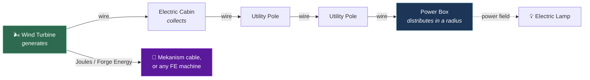

<div align="center">

# ⚡ Electricity

**Real electrical grids for Minecraft.** Utility poles, wind turbines driven by a live
weather model, wires that lose power over distance — and now a turbine that talks to
Mekanism and answers to ComputerCraft.


</div>

> [!NOTE]
> This is a **fork** of [dooji2/electricity](https://github.com/dooji2/electricity).
> The grid simulation, the weather model, the blocks and the art are all dooji's work.
> What this fork adds is everything under [Integrations](#integrations): the turbine
> now feeds other mods' energy networks, reports itself as a ComputerCraft peripheral
> with 63 plant signals, and can be stopped and curtailed.

---

## How a grid works

Power flows along a fixed chain. Wires connect *insulators*, not blocks, so components
can sit far apart — at the cost of losing power over the distance.



The chain is enforced: a turbine only feeds a cabin, a cabin only feeds a pole, a pole
feeds poles or a power box. The branch to Mekanism is what this fork adds.

**Two things about wires.** Power drops with distance — roughly 1% per block of wire.
And running *more* wires between the same two poles preserves it better, so a long run
is worth doubling up.

## Integrations

<table>
<tr><td width="50%" valign="top">

### 🔌 Mekanism & Forge Energy

The turbine exposes its output as **Joules** on its bottom and back faces and pushes to
whatever is adjacent each tick, the same way a Mekanism generator emits. Universal
Cables draw from it directly; any Forge Energy machine works too.

One kW is **125 J/tick**, derived from the mod's own numbers rather than invented: the
Power Box has always run at 50 FE per kW, and Mekanism defaults to 2.5 J per FE.

Nothing is double-spent. Generation opens a per-tick budget, foreign cables claim from
it, and the wire network receives only what is left.

→ [Integrations guide](docs/integrations.md)

</td><td width="50%" valign="top">

### 💻 ComputerCraft

A peripheral of type `electricity_wind_turbine`, readable directly or over a wired
modem on network cable.

```lua
local t = peripheral.find("electricity_wind_turbine")
print(t.getActivePower() .. " kW")
print(t.getGearBoxOilTemp() .. " C")
t.setActivePowerLimit(40)   -- curtail
t.stop()                    -- brake
```

63 signals modelled on real turbine SCADA tags, and method names shared with Mekanism's
generators so existing programs work unchanged.

→ [Full API reference](docs/telemetry.md)

</td></tr>
</table>

### 🎛️ Control

Stop, start and curtail a turbine from a computer, or wire it to redstone with
`DISABLED` / `HIGH` / `LOW` modes — the same names Mekanism uses.

A **stop** brakes the rotor and feathers the blades. A **curtailment** just holds output
at a setpoint while the machine keeps turning. The telemetry tells the two apart, and
tells both apart from the machine shutting itself down in a gale.

### 🌪️ Storm control

Above 22 m/s the turbine no longer trips straight to zero. It sheds a fifth of rated per
m/s — 80%, 60%, 40% at 22, 23 and 24 — and brakes at 25. Coming off full load in one
step is a shock to the drivetrain, and no real turbine does it.

→ [Power curve, thresholds and all the numbers](docs/telemetry.md#power-curve)

## Blocks and items

| | Name | What it does |
|---|---|---|
| 🌬️ | **Wind Turbine** | Generates from wind. Yaws to follow it, pitches its blades above rated speed, brakes in a storm. |
| 📦 | **Electric Cabin** | Collects from generators and passes it to utility poles. Two insulators: **left is output, right is input**. |
| 🗼 | **Utility Pole** | Carries power across distance. Eight insulators, configurable. |
| 🔋 | **Power Box** | Distributes within a radius, and bridges to Forge Energy. |
| 💡 | **Electric Lamp** | Example consumer. Has wear, burns out, reacts to power quality. |
| 🔧 | **Power Wrench** | Opens a live diagnostics panel on any electric block. |
| 🧵 | **Wire** | Right-click one insulator, then another. |
| 🛠️ | **Electric Workbench** | Crafts every component below. |
| 📡 | **Weather Tablet** | Weather intensity map. Not functional yet. |

Components — Circuit Board, CPU, Screen, Insulator, Metal Casing, Motor Core — are all
made at the Electric Workbench. Recipes are visible in-game; use JEI or the workbench UI.

## Getting started

1. Craft an **Electric Workbench** at a crafting table, then the components at it.
2. Place a **Wind Turbine** somewhere with wind — check it with the Weather Tablet.
   Below 3 m/s it produces nothing.
3. With a **Wire** in hand, right-click the turbine's insulator, then the **right**
   insulator of an **Electric Cabin**.
4. Cabin's **left** insulator → a **Utility Pole** → more poles → the **Power Box**
   (its insulator is underneath).
5. Place **Electric Lamps** inside the Power Box's radius.

→ [Step-by-step guide](docs/getting-started.md)

## Configuration

`<world>/serverconfig/Electricity/server.toml` — server configs live inside the world
folder, not in `config/`.

| Key | Default | Meaning |
|---|---|---|
| `powerBoxRadius` | 5 | Radius of the Power Box's field, in blocks |
| `externalEnergyEnabled` | true | Let generators feed other mods' energy systems |
| `turbineMaxJoulesPerTick` | 480.0 | Cap on what a turbine hands to foreign cables |

The 480 J/t default matches Mekanism's own Wind Generator maximum, which means a turbine
gives Mekanism about 5% of its peak. Raise it if you want turbines to be a serious
supply for a Mekanism base.

## Building from source

```bash
./gradlew build          # jar lands in build/libs/
./gradlew runClient      # dev client, with Mekanism and CC:Tweaked included
```

Java 17. Mekanism and CC:Tweaked are `compileOnly`, so the mod builds and runs without
either installed — every reference to them is confined to one class each, behind a
`ModList` check.

## Credits and licence

Created by **dooji** — [dooji2/electricity](https://github.com/dooji2/electricity).
Upstream is the origin of the grid simulation, the weather model, the blocks and all the
art. This fork adds the integrations described above.

- **Code** — GNU GPL v3.0 only, see [`LICENSES/LICENSE-CODE`](LICENSES/LICENSE-CODE)
- **Assets** (models, textures, audio) — **All Rights Reserved** to the original author,
  see [`LICENSES/LICENSE-ASSETS`](LICENSES/LICENSE-ASSETS)

> [!IMPORTANT]
> The asset licence is why this fork is not published anywhere. Redistributing it with
> the original models and textures would need dooji's permission, or replacement art.
